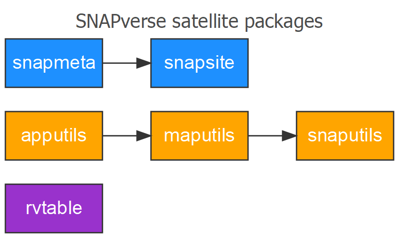
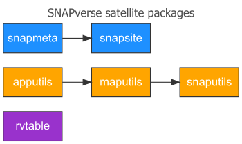

<!-- README.md is generated from README.Rmd. Please edit that file -->

```{r setup, include = FALSE}
knitr::opts_chunk$set(
  collapse = TRUE, comment = "#>", fig.path = "man/figures/README-",
  message = FALSE, warning = FALSE, error = FALSE, tidy = TRUE
)
```

# apputils

[](https://travis-ci.org/leonawicz/rapputils)
[](https://ci.appveyor.com/project/leonawicz/apputils)
[](https://codecov.io/github/leonawicz/apputils?branch=master)

`apputils` is an R package containing common utilty functions, settings and references for development use across multiple Shiny apps. It has a `shinydashboard` focus. `apputils` is a satellite member of the [SNAPverse](https://leonawicz.github.io/snapverse/) collection of R packages. It supports other satellites in the verse, including [`maputils`](https://leonawicz.github.io/maputils/) and [`snaputils`](https://leonawicz.github.io/snaputils/).


```{r is_md, echo = FALSE}
is_md <- knitr::opts_knit$get("rmarkdown.pandoc.to") == "markdown_github-ascii_identifiers"
```

```{r md_doc1, echo = FALSE, results = "asis", eval = is_md}
cat('<p style="text-align:center;"></p><br>')
```

```{r html_doc1, echo = FALSE, results = "asis", eval = !is_md}
cat('<p style="text-align:center;"></p>')
```

## Functionality

Package functionality and areas of support covered by `apputils` include:

* Overrides of `shinydashboard::valueBox`, `shinydashbaord::infoBox` and `shiny::icon` that support the use of local thumbnails images.
* Stat boxes: special type of value or info boxes for common statistics using a collection of icons provided by the package.
* Adjusted CSS styles and integration with packages like `rintrojs` and `shinytoastr` for interactive tours and toast messages.
* Functions for including app information widgets such as citations, contact info, frequently asked questions and more.
* Encapsulation of working with data frames in server.R in specific contexts and use cases to simplify code.
* Wrappers around specific use cases for Leaflet maps, data tables, and general plotting in apps.
* Helper functions for dynmaic reports.

## Installation

You can install maputils from github with:

```{r gh-installation, eval = FALSE}
# install.packages("devtools")
devtools::install_github("leonawicz/apputils")
```

## Reference

The complete set of satellite packages is shown below.

```{r md_doc2, echo = FALSE, results = "asis", eval = is_md}
cat('<p style="text-align:center;"></p><br>')
```

```{r html_doc2, echo = FALSE, results = "asis", eval = !is_md}
cat('<p style="text-align:center;"></p>')
```

```{r md_pkg_ref, echo = FALSE, results = "asis", eval = is_md}
cat('## Reference\n\n[Complete package reference and function documentation](https://leonawicz.github.io/alfresco/)')
```

